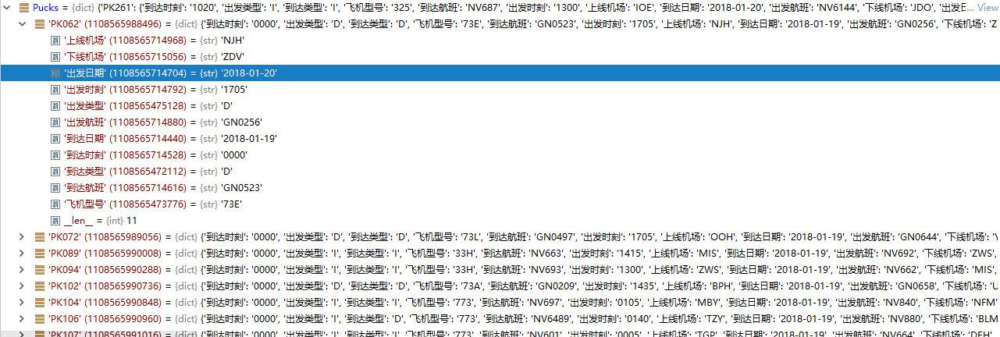

> Code collection of topic F in 15th Chinese Graduates' Mathematical Contest in Modeling for the Graduate students of China, 2018.

> Assessment of the impact of the new airport satellite hall on transit passengers
## 1.代码结构
- lib: 存放函数，包括数据读取，数学模型，常用函数等
- solution: 实验和
    - problem1:图表、数据文件，问题一相关代码
    - problem2:图表、数据文件，问题二相关代码
    - problem3:图表、数据文件，问题三相关代码

## 2.项目日志/留言板
- 创建项目结构--陈旭 2018.9.15 23:57
- 完成Excel文件数据读取和转换,经过转换后的数据如下. --陈旭 2018.9.16 15:02

